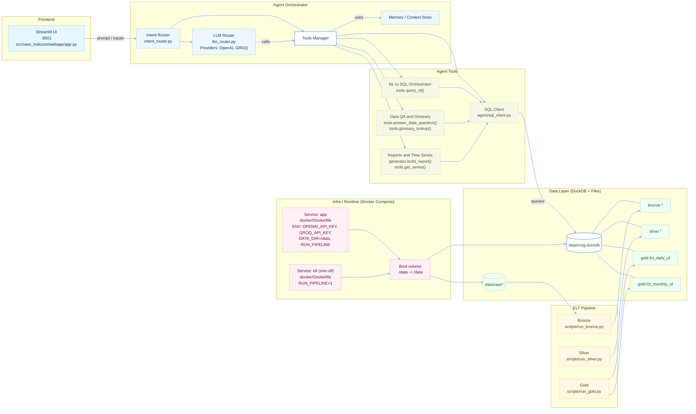

<p align="center">
  

<h1 align="center">SRAG — Dashboard & Agente</h1>

<p align="center">
  Painel analítico e agente conversacional para SRAG (Síndrome Respiratória Aguda Grave) com
  <b>DuckDB</b>, <b>Streamlit</b> e <b>LLM routing</b> (OpenAI/Groq).
  Inclui <b>ELT</b> bronze→silver→gold, consultas <b>NL→SQL</b> seguras e coleta de <b>notícias</b> do Brasil.
</p>

<p align="center">
  <a href="https://python.org"></a>
  <a href="https://duckdb.org"></a>
  <a href="https://streamlit.io"></a>
  
</p>

<hr/>

## Visão geral

O projeto entrega dois componentes principais:

1) **Dashboard (Streamlit)**  
   KPIs (janela 30d), séries **diária (30d)** e **mensal (12m)**, ranking de UFs por casos e um **chat** integrado ao agente.

2) **Agente SRAG (LLM-routed)**  
   Entende intenção (PT-first), acessa o **dicionário de dados**, busca **notícias recentes** (Tavily), executa **consultas em linguagem natural → SQL** com *guardrails* e gera relatório padrão (BR/UF).


---

## Principais funcionalidades

- **Relatório padrão** (BR/UF) com sumário executivo, KPIs e comentários.  
- **Notícias recentes** sobre SRAG no Brasil, com **links** das fontes.  
- **Explicação de termos/métricas** (glossário).  
- **NL→SQL (seguro)**: interpreta pedidos em linguagem natural e gera **SELECT** DuckDB válido, com *whitelist* de tabelas e **LIMIT** automático.  
- **Data QA**: perguntas sobre o dicionário/esquema respondidas via LLM com *grounding*.  
- **Tendências**: comentário rápido (7d vs 7d anteriores) com base nas séries do painel.

---

## Stack técnica

- **Linguagem:** Python 3.12+  
- **Frontend:** Streamlit  
- **Banco analítico:** DuckDB (arquivo local `data/srag.duckdb`)  
- **LLM routing:** OpenAI e/ou Groq (fallback automático), controlado por env  
- **Busca de notícias:** Tavily  
- **Templates:** Jinja2 (relatório)  
- **Gráficos:** Plotly

---

## Arquitetura



---

## Modelo de dados (camada gold)

Tabelas principais usadas pelo painel e pelo NL→SQL:

- `gold.fct_daily_uf(day, uf, cases, deaths, icu_cases, vaccinated_cases, pending_60d_cases, closed_cases_30d, deaths_30d, median_symptom_to_notification_days, median_icu_los_days, cfr_closed_30d_pct, icu_rate_pct, vaccinated_rate_pct, pending_60d_pct, cases_ma7, deaths_ma7)`

- `gold.fct_monthly_uf(month, uf, cases, deaths, icu_cases, vaccinated_cases, pending_60d_cases, closed_cases_30d, deaths_30d, median_symptom_to_notification_days, median_icu_los_days, cfr_closed_30d_pct, icu_rate_pct, vaccinated_rate_pct, pending_60d_pct)`

> O agente NL→SQL está **restrito** por padrão às tabelas `gold.*` para reduzir risco e simplificar o contexto.

---

## Agente — intenções & ferramentas

### Intenções suportadas
- `greet` — saudação/apresentação  
- `news` — últimas notícias (com links)  
- `report` — relatório padrão (BR/UF)  
- `explain` — explicação de termo/métrica  
- `dataqa` — perguntas sobre dicionário/esquema/colunas  
- `nlquery` — consulta em linguagem natural → SQL seguro  
- `trend` — comentário de tendência (7d vs 7d anteriores)  
- `compare` — comparação/ranking (placeholder)  
- `chitchat` — conversa leve sem números operacionais  
- `unknown` — fallback para pedir mais detalhes

### Ferramentas principais (`agent/tools.py`)
- **`answer_data_question()`**: QA do dicionário de dados com *grounding* em tabelas/colunas/métricas.  
- **`nl_to_sql()`**: traduz PT → SQL DuckDB (somente `SELECT`), sempre com `LIMIT`.  
- **`run_sql_text_safe()`**: executa SQL *read-only*, bloqueando DDL/DML e checando *whitelist* de tabelas.  
- **`query_nl()`**: *pipeline* de alto nível (NL→SQL→exec) que retorna `(DataFrame, SQL)`.  
- **`build_schema_snapshot()`**: snapshot do esquema + métricas para orientar o LLM (contexto compacto).

---

## Organização do repositório

```
case-indicium/
├─ src/case_indicium/
│  ├─ agent/           # agente, intent router, news client, tools NL→SQL, etc.
│  ├─ etl/             # bronze/silver e orquestração local
│  ├─ sql/             # views/checagens para camada gold
│  ├─ templates/       # Jinja2 (ex.: report.md.j2)
│  ├─ utils/           # utilitários (config, duckdb, io)
│  └─ webapp/          # app Streamlit (app.py)
├─ assets/             # logos/imagens do app
├─ data/               # srag.duckdb e raw/
├─ notebooks/          # EDA (dev)
├─ scripts/            # scripts utilitários
├─ .streamlit/         # config do Streamlit
├─ .env.example        # exemplo de variáveis de ambiente
├─ pyproject.toml      # deps (Poetry)
└─ README.md
```

---

## Variáveis de ambiente

Arquivo `.env` (exemplo em `.env.example`):

```env
# LLMs (pelo menos uma)
OPENAI_API_KEY=sk-xxxx
GROQ_API_KEY=gsk_xxxx

# Busca de notícias
TAVILY_API_KEY=tvly-dev-xxxx
```

---

## Como rodar
### 1. Configurar o .env
```
cp .env.example .env
# Configurar as API Keys
```
### 2. Build da Imagem Docker
```
docker compose build
```
### 3. Rodar o ELT
```
docker compose run --rm etl

```
#### Esse processo irá demorar um pouco, devido ao download de todos os arquivos CSVs

### 4. Subir o app
```
docker compose up -d app
docker compose logs -f app
```
### Com isso basta Acessar: http://localhost:8501
### 5. Parar serviços
```
docker compose down
```


## Fluxos de trabalho

- **ELT local**: Ingestão de bases SRAG (bronze) → padronização/limpeza (silver) → fatos & views (gold).  
- **Relatório padrão**: `agent/generator.py` + `templates/report.md.j2` produzem markdown com KPIs/séries.  
- **Agente no app**: o Streamlit usa `intent_router.handle()` para rotear a mensagem e acionar as *tools*.

---

## Possiveis Melhorias Futuras

- Melhorar tratamento e Limpeza de Dados.  
- Mais testes para NL→SQL e *guardrails*.  
- Cache para notícias.  
- Mais tabelas tratadas e relacionadas.
---

