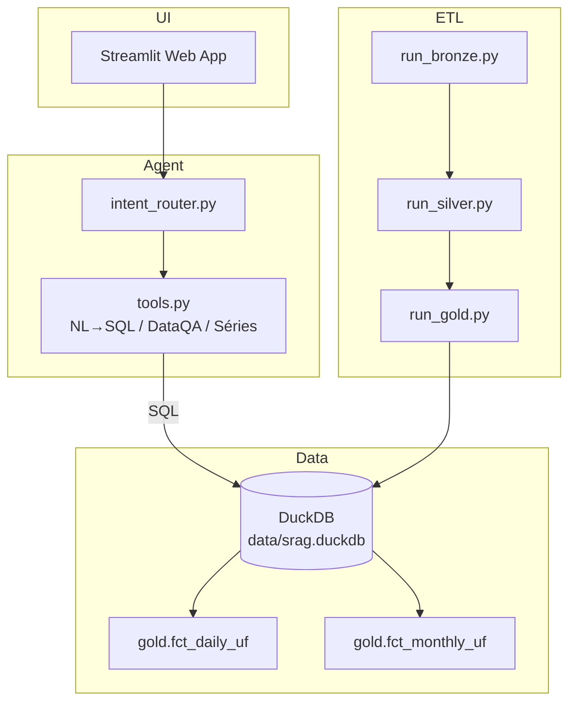
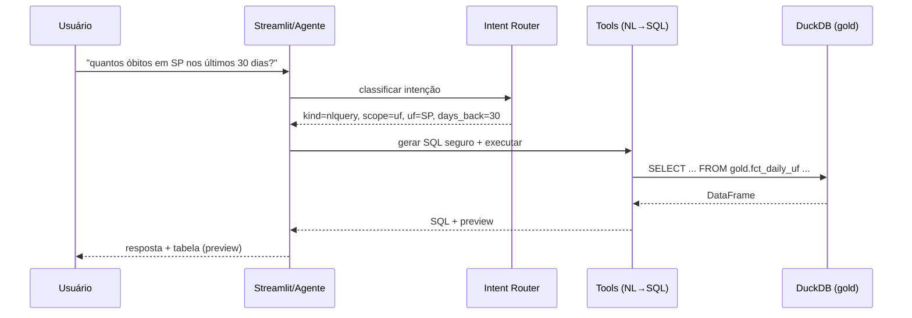

# Arquitetura do Agente SRAG (Case-Indicium)

> **Visão técnica do projeto SRAG (ETL DuckDB + Agente NL→SQL + Streamlit) e containerização com Docker/Poetry.**  
> Este documento foca em _arquitetura_, _componentes_ e _fluxos_. Não é um guia de execução passo-a-passo.

---

## Sumário
- [Visão Geral](#visão-geral)
- [Stack Tecnológica](#stack-tecnológica)
- [Componentes Principais](#componentes-principais)
- [Fluxo de Dados (ETL e Consulta)](#fluxo-de-dados-etl-e-consulta)
- [Arquitetura Lógica (Diagramas)](#arquitetura-lógica-diagramas)
- [Schema de Dados (Camada Gold)](#schema-de-dados-camada-gold)
- [Roteamento de Intenções (Intent Router)](#roteamento-de-intenções-intent-router)
- [NL→SQL Seguro](#nlsql-seguro)
- [Aplicação Web (Streamlit)](#aplicação-web-streamlit)
- [Containerização (Docker)](#containerização-docker)
- [Observabilidade e Logs](#observabilidade-e-logs)
- [Segurança e Boas Práticas](#segurança-e-boas-práticas)
- [Roadmap técnico](#roadmap-técnico)
- [Estrutura de Diretórios](#estrutura-de-diretórios)

---

## Visão Geral

O projeto **SRAG** (Síndrome Respiratória Aguda Grave) consolida dados em **DuckDB** por meio de um **pipeline ETL (bronze → silver → gold)** e expõe:
1) um **agente de linguagem** capaz de responder perguntas em PT-BR sobre os dados (com **NL→SQL seguro**), e  
2) uma **aplicação Streamlit** com relatório e inspeções rápidas.

A solução foi dockerizada (app + job de ETL) e utiliza **Poetry** para gestão de dependências, garantindo reprodutibilidade.

---

## Stack Tecnológica

- **Linguagem:** Python 3.12
- **Data Engine:** DuckDB (local, em arquivo `.duckdb` sob `data/`)
- **Web UI:** Streamlit
- **Agent/LLM:** OpenAI / Groq (roteamento leve), prompts PT-BR
- **Orquestração local:** Docker + Docker Compose
- **Gerenciamento de pacotes:** Poetry
- **Data assets:** Parquet/CSV em `data/` (camadas bronze/silver) e tabelas gold materializadas

> Dependências de destaque: `duckdb`, `pandas`, `streamlit`, `plotly/matplotlib`, `openai`, `groq`, `tabulate` (prévia de DataFrame em markdown).

---

## Componentes Principais

1. **ETL local (`scripts/`):**  
   - `run_bronze.py` → ingestão/landing (raw → bronze)  
   - `run_silver.py` → limpeza/normalização (bronze → silver)  
   - `run_gold.py` → agregações e métricas (silver → gold)  
   - `run_pipeline.py` → orquestra a sequência completa

2. **Agente SRAG (`src/case_indicium/agent/`):**
   - `intent_router.py` → classifica intenção (greet|news|report|explain|dataqa|nlquery|trend|compare|chitchat|unknown)  
   - `tools.py` → NL→SQL seguro, Q&A de dicionário, séries/indicadores  
   - `sql_client.py` → acesso DuckDB; resolve caminho do `.duckdb` via `DATA_DIR`/heursticas
   - `metrics_registry.py` → mapeia métricas derivadas

3. **Aplicação Web (`src/case_indicium/webapp/app.py`):**  
   - Relatório Brasil/UF (KPIs, séries), blocos do agente (chat), prévias de consultas

4. **Empacotamento/Runtime:**  
   - `Dockerfile`, `docker-compose.yml`, `entrypoint.sh`  
   - **Serviço `etl`** (job one-off) e **serviço `app`** (Streamlit)

---

## Fluxo de Dados (ETL e Consulta)

**ETL (arquivos → DuckDB):**
1. **Bronze**: Carrega arquivos brutos (ex.: `data/raw/`) para tabelas _landing_.
2. **Silver**: Limpa/normaliza, padroniza tipos, corrige nulos, gera chaves.
3. **Gold**: Agrega por período/UF, calcula indicadores e salva tabelas finais (ex.: `gold.fct_daily_uf`, `gold.fct_monthly_uf`).

**Consulta (Agente/Web):**
- O **agente** interpreta a pergunta (intent), quando “nlquery” traduz para **SQL** restrito às tabelas gold e executa via `SQLClient`.
- A **UI** consome consultas preparadas (KPIs e séries) e exibe gráficos/tabelas.

---

## Arquitetura Lógica (Diagramas)

### Componentes



### Sequência (NL→SQL)



---

## Schema de Dados (Camada Gold)

Tabelas principais consolidadas para consumo pelo agente e UI:

### `gold.fct_daily_uf`
| coluna | tipo | descrição |
|---|---|---|
| `day` | date | dia calendário |
| `uf` | text | Unidade Federativa (sigla) |
| `cases` | int | casos no dia |
| `deaths` | int/float | óbitos no dia |
| `icu_cases` | int/float | casos com passagem por UTI |
| `vaccinated_cases` | int/float | casos com vacinação registrada |
| `pending_60d_cases` | int/float | pendências até 60d |
| `closed_cases_30d` | int/float | casos encerrados na janela 30d |
| `deaths_30d` | int/float | óbitos em coorte 30d |
| `median_symptom_to_notification_days` | float | mediana dias sintoma→notificação |
| `median_icu_los_days` | float | mediana LOS em UTI |
| `cfr_closed_30d_pct` | float | letalidade (%) entre casos encerrados (30d) |
| `icu_rate_pct` | float | % casos com UTI (30d) |
| `vaccinated_rate_pct` | float | % casos vacinados (30d) |
| `pending_60d_pct` | float | % pendentes (≤60d) |
| `cases_ma7`, `deaths_ma7` | float | médias móveis 7d |

### `gold.fct_monthly_uf`
| coluna | tipo | descrição |
|---|---|---|
| `month` | date | primeiro dia do mês |
| `uf` | text | UF |
| `cases`, `deaths`, `icu_cases`, ... | variados | agregações mensais e taxas |

> **Nota:** O agente foi instruído a **priorizar a camada gold**, reduzindo risco de SQL incorreto e garantindo consistência.

---

## Roteamento de Intenções (Intent Router)

Arquivo: `src/case_indicium/agent/intent_router.py`

- **LLM-first**: Classifica em `greet|news|report|explain|dataqa|nlquery|trend|compare|chitchat|unknown`.
- Extrai dicas: `scope (br|uf)`, `uf`, `days_back (1|7|30|90)` e `metric` (quando aplicável).
- **Fallback leve por regras** quando LLM indisponível/indeciso.
- `handle()` retorna **Markdown** + **Intent** resolvida para a UI.

Benefícios:
- UX conversacional em PT-BR
- Encaminhamento para **NL→SQL** quando apropriado
- Reuso de contexto simples (follow-ups como “e no RJ?”)

---

## NL→SQL Seguro

Arquivo: `src/case_indicium/agent/tools.py` (funções `query_nl`, etc.)

- **Vocabulário guiado** (UF, período, métricas conhecidas) → _prompting_ para evitar alucinações.
- **Restrição de schema**: só consulta **`gold.fct_daily_uf`** e **`gold.fct_monthly_uf`**.
- **Limite de linhas** (`max_rows`) e preview em Markdown com `tabulate`.
- Retorna **(DataFrame, SQL usado)** para exibição transparente na UI.

Exemplo de SQL gerado (ilustrativo):
```sql
SELECT uf, SUM(deaths_30d) AS total_obitos
FROM gold.fct_daily_uf
WHERE day >= CURRENT_DATE - INTERVAL '30 day'
GROUP BY uf
ORDER BY total_obitos DESC
LIMIT 200;
```

---

## Aplicação Web (Streamlit)

Arquivo: `src/case_indicium/webapp/app.py`

- Abas/áreas para: **Relatório BR/UF**, **Consulta NL→SQL**, **Glossário/Métricas**, **Tendências**.
- Usa `SQLClient` para ler o arquivo `.duckdb` (caminho definido por `DATA_DIR` ou padrão).
- Caching leve (`st.cache_data`) para KPIs/séries.
- Mensagens claras quando faltam dados (p.ex., DB não encontrado).

---

## Containerização (Docker)

- **Imagens**: única base (Python slim + Poetry), dois serviços via Compose:
  - `etl`: job de preparação (`RUN_PIPELINE=1`) → executa `bronze → silver → gold` e finaliza.
  - `app`: servidor Streamlit (`RUN_PIPELINE=0`) → expõe porta `8501`.

- **Volumes**: `./data:/data` para persistência do `.duckdb` fora do container.
- **Entrypoint** (`entrypoint.sh`):
  - Se `RUN_PIPELINE=1`, tenta `etl-all` e, se ausente, `bronze→silver→gold` diretamente pelo módulo.
  - Se `RUN_PIPELINE=0`, sobe Streamlit com `PYTHONPATH=/app/src`.

> **Poetry** roda em _package-mode_ (instala o projeto e deps) ou `--no-root` no job de ETL quando scripts são importados via módulo.

---

## Observabilidade e Logs

- Logs de **entrypoint** (modo ETL ou APP) → diagnóstico rápido.
- Streamlit imprime URL e _tracebacks_ úteis.
- NL→SQL exibe o **SQL final** e uma **prévia** do DataFrame para auditoria manual.
- Recomendado: padronizar `logging` no ETL e no agente.

---

## Segurança e Boas Práticas

- **Princípio do menor privilégio**: agente só lê **gold**; escrita apenas pelo ETL.
- **Isolamento de dados**: arquivo `.duckdb` montado via volume, sem expor credenciais.
- **Limitação NL→SQL**: janela e colunas conhecidas; ordenar/limitar resultados.
- **.env**: chaves de LLM (`OPENAI_API_KEY`, `GROQ_API_KEY`) e parâmetros do app; **não commitar**.
- **.gitignore**: mantém apenas `data/raw/data_urls.json` sob versionamento.

---

## Roadmap técnico

- **Comparativos/Rankings por UF** (telas e intents dedicadas).
- **Camada de cache** para respostas NL→SQL populares.
- **Testes unitários** em `agent` e **gold checks** (consistência diária).
- **Metrics/Tracing** (Prometheus, OpenTelemetry) em produção.
- **Feature flags** (ex.: INTENT_USE_LLM=0 para modo totalmente determinístico).

---
